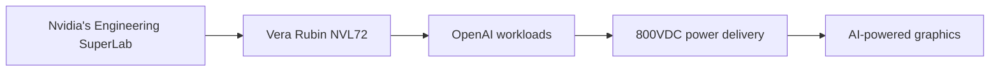

## Unveiling the Future of AI-Powered Graphics: Nvidia's Engineering SuperLab

In a recent tour of Nvidia's Engineering SuperLab, the company showcased its latest advancements in AI-powered graphics. The lab, featuring the Vera Rubin NVL72, demonstrated the capabilities of Nvidia's technology in handling OpenAI workloads, 800VDC, and more. In this article, we'll delve into the details of Nvidia's Engineering SuperLab and explore the implications of AI-powered graphics on the future of gaming and computing.

## AI-Powered Graphics: The Next Frontier

Nvidia's Engineering SuperLab is a testament to the company's commitment to pushing the boundaries of AI-powered graphics. The lab features the Vera Rubin NVL72, a high-performance server designed to handle complex AI workloads. With the Vera Rubin NVL72, Nvidia is able to demonstrate the capabilities of its technology in handling tasks such as image recognition, natural language processing, and more.

One of the key features of Nvidia's AI-powered graphics is its ability to switch between different AI models in real-time. This is made possible by the company's DLSS 5 technology, which allows for seamless transitions between different AI modes. This capability has significant implications for the future of gaming, as it enables developers to create more realistic and immersive experiences.

## 800VDC: A New Era in Power Delivery

In addition to its AI-powered graphics capabilities, Nvidia's Engineering SuperLab also showcased the company's latest advancements in power delivery. The lab featured a demonstration of 800VDC, a new standard for power delivery that promises to revolutionize the way we think about power distribution.

With 800VDC, Nvidia is able to deliver more power to its GPUs while reducing energy consumption. This is achieved through the use of advanced power conversion technologies that enable the efficient transfer of power over long distances. The implications of 800VDC are significant, as it promises to enable the development of more powerful and efficient computing systems.

## Conclusion

Nvidia's Engineering SuperLab is a testament to the company's commitment to pushing the boundaries of AI-powered graphics. With its advanced AI capabilities and 800VDC power delivery, Nvidia is setting the stage for a new era in gaming and computing. As we look to the future, it's clear that AI-powered graphics will play a major role in shaping the way we experience games and other interactive applications.

Whether you're a gamer, a developer, or simply someone interested in the latest advancements in technology, Nvidia's Engineering SuperLab is a must-see destination. With its cutting-edge AI capabilities and 800VDC power delivery, the lab is a glimpse into the future of computing and gaming.

This diagram illustrates the relationship between Nvidia's Engineering SuperLab, the Vera Rubin NVL72, OpenAI workloads, 800VDC power delivery, and AI-powered graphics. The lab serves as a hub for demonstrating the company's latest advancements in AI-powered graphics, including the Vera Rubin NVL72 and 800VDC power delivery. These technologies work together to enable the development of more realistic and immersive gaming experiences.
