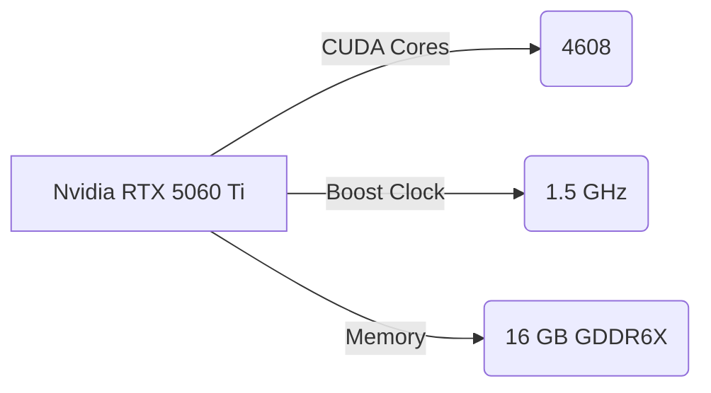
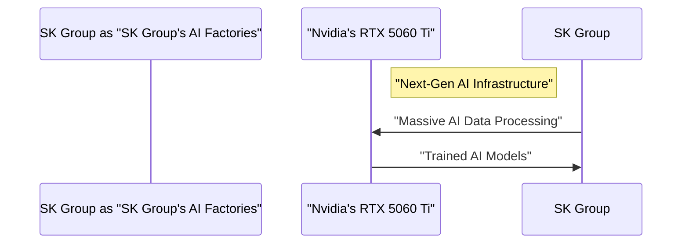

## Introduction

The recent $500 billion AI partnership between Nvidia and SK Group marks a significant milestone in the development of next-gen AI infrastructure. At the heart of this partnership lies the Nvidia RTX 5060 Ti, a powerful GPU designed to supercharge AI applications. In this deep dive, we'll explore the technical aspects of the RTX 5060 Ti, its role in the AI partnership, and the implications for the future of AI development.

## Architecture and Performance

The Nvidia RTX 5060 Ti is built on the Ampere architecture, which features a new 8nm process node and a significant increase in CUDA cores. The GPU boasts 4608 CUDA cores, a 1.5 GHz boost clock, and 16 GB of GDDR6X memory. This configuration enables the RTX 5060 Ti to deliver exceptional performance in AI workloads, with a reported 2x increase in performance over the previous generation.

## AI Partnership and Next-Gen Infrastructure

The Nvidia RTX 5060 Ti is designed to play a crucial role in the $500 billion AI partnership between Nvidia and SK Group. The partnership aims to create a next-gen AI infrastructure that will enable the development of more sophisticated AI applications. The RTX 5060 Ti will be used to power SK Group's massive AI factories, which will be capable of processing vast amounts of data and training complex AI models.

## Implications for the Future of AI Development

The Nvidia RTX 5060 Ti and the $500 billion AI partnership between Nvidia and SK Group have significant implications for the future of AI development. The partnership will enable the creation of more sophisticated AI applications, which will have a profound impact on various industries, including healthcare, finance, and education.

## Conclusion

In conclusion, the Nvidia RTX 5060 Ti is a powerful GPU designed to supercharge AI applications. Its role in the $500 billion AI partnership between Nvidia and SK Group marks a significant milestone in the development of next-gen AI infrastructure. As we move forward, we can expect to see more sophisticated AI applications that will have a profound impact on various industries. The Nvidia RTX 5060 Ti is a key component in this journey, and its performance and architecture will play a crucial role in enabling the development of more complex AI models.
