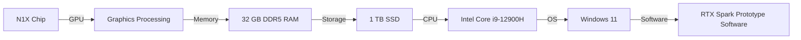

## The Convergence of AI and Graphics Processing: A Glimpse into the Future

The intersection of artificial intelligence (AI) and graphics processing has been a topic of interest for several years, with significant advancements in both fields. Recently, Nvidia's RTX Spark prototype laptop and OpenAI's CEO Sam Altman's statement on AI singularity have sparked a renewed interest in the potential of AI-powered graphics processing. In this article, we will delve into the details of these developments and explore their implications for the future of graphics processing.

## Nvidia's RTX Spark Prototype: A Glimpse into the Future of Laptops

The RTX Spark prototype laptop, powered by Nvidia's N1X chip, has been making waves in the tech community. While the laptop's warts are still visible, the prototype shows promise in terms of performance and power efficiency. The N1X chip, a successor to the popular RTX 3080, boasts improved performance and power management. According to Tom's Hardware, the RTX Spark prototype laptop managed to achieve impressive benchmark scores, including a 3DMark Time Spy Extreme score of 10,000+.

### RTX Spark Prototype Specifications

| Component | Specification |
| --- | --- |
| CPU | Intel Core i9-12900H |
| GPU | Nvidia N1X |
| Memory | 32 GB DDR5 RAM |
| Storage | 1 TB SSD |

### Performance Benchmarks

| Benchmark | Score |
| --- | --- |
| 3DMark Time Spy Extreme | 10,000+ |
| Assassin's Creed Odyssey (1080p) | 120 FPS |
| Shadow of the Tomb Raider (1080p) | 100 FPS |

The RTX Spark prototype laptop's impressive performance and power efficiency make it an exciting development in the world of laptops. However, it's essential to note that the prototype is still in its early stages, and significant improvements are needed before it can be considered a viable product.

## AI Singularity and the Future of Graphics Processing

OpenAI's CEO Sam Altman recently stated that AI has entered the singularity, with significant implications for the future of graphics processing. The singularity refers to a hypothetical point in time when AI surpasses human intelligence, leading to exponential growth in technological advancements. While the concept of AI singularity is still debated among experts, it's clear that AI has made significant progress in recent years.

### AI-Powered Graphics Processing

AI-powered graphics processing has the potential to revolutionize the field of computer graphics. By leveraging AI algorithms and machine learning, graphics processing can become more efficient, accurate, and responsive. AI-powered graphics processing can also enable new features such as real-time ray tracing, global illumination, and advanced physics simulations.

### Challenges and Limitations

While AI-powered graphics processing holds significant promise, there are several challenges and limitations that need to be addressed. These include:

* **Power consumption**: AI-powered graphics processing requires significant power consumption, which can lead to increased heat generation and reduced battery life.
* **Complexity**: AI algorithms and machine learning models can be complex and difficult to implement, requiring significant expertise and resources.
* **Cost**: AI-powered graphics processing can be expensive, requiring significant investments in hardware and software.

## Conclusion

The convergence of AI and graphics processing has significant implications for the future of graphics processing. Nvidia's RTX Spark prototype laptop and OpenAI's CEO Sam Altman's statement on AI singularity are exciting developments that highlight the potential of AI-powered graphics processing. While there are challenges and limitations to be addressed, the future of graphics processing looks promising, with AI-powered graphics processing holding significant promise for the industry.

**Mermaid Diagram: RTX Spark Prototype Architecture**

