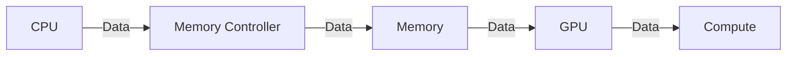

## The Future of AI Infrastructure: A $500 Billion Partnership

In a groundbreaking move, Nvidia and SK Group have announced a $500 billion AI partnership aimed at supercharging AI infrastructure with next-gen memory and massive AI factories. This behemoth of a partnership is poised to revolutionize the AI landscape, but what does it mean for the average gamer and developer?

## The Rise of Affordable Gaming PCs: Thermaltake's View u2660T-170 Deal

As we dive deeper into the world of AI, it's essential to acknowledge the significant advancements in gaming PCs. Thermaltake's View u2660T-170 has been slashed by 33%, making it possible to grab an Nvidia RTX 5060 Ti gaming PC with a Core Ultra 7 CPU and 32GB RAM for under $1,200. This deal is a game-changer for gamers and developers alike, providing an affordable entry point into the world of high-performance computing.

## The Physics of Next-Gen Memory

So, what exactly is next-gen memory, and how does it contribute to the AI revolution? Next-gen memory refers to the latest advancements in memory technologies, such as HBM (High-Bandwidth Memory) and HBM2. These memory technologies offer significantly higher bandwidth and lower latency compared to traditional DDR4 memory.



In the context of AI, next-gen memory is crucial for achieving high-performance computations. The memory controller plays a vital role in managing data flow between the CPU, memory, and GPU. By utilizing next-gen memory, the memory controller can optimize data transfer rates, reducing latency and increasing overall system performance.

## The Impact of Next-Gen Memory on AI Workloads

The impact of next-gen memory on AI workloads is substantial. With increased bandwidth and lower latency, AI models can process larger datasets and perform more complex computations. This, in turn, enables AI systems to learn and adapt at a faster rate, leading to significant advancements in fields like computer vision, natural language processing, and reinforcement learning.

```latex
\begin{equation}
\text{Performance} = \frac{\text{Bandwidth}}{\text{Latency}} \times \text{Compute Power}
\end{equation}
```

As we can see from the equation above, the performance of an AI system is directly proportional to the bandwidth and inverse proportional to the latency. By utilizing next-gen memory, AI systems can achieve significant performance boosts, enabling them to tackle more complex tasks and drive innovation in various fields.

## Conclusion

The $500 billion AI partnership between Nvidia and SK Group, combined with the rise of affordable gaming PCs, marks a significant turning point in the world of AI and high-performance computing. As next-gen memory technologies continue to advance, we can expect to see even more impressive breakthroughs in AI capabilities. With the Thermaltake View u2660T-170 deal, gamers and developers now have access to high-performance computing at an affordable price, making it an exciting time for the industry as a whole.
