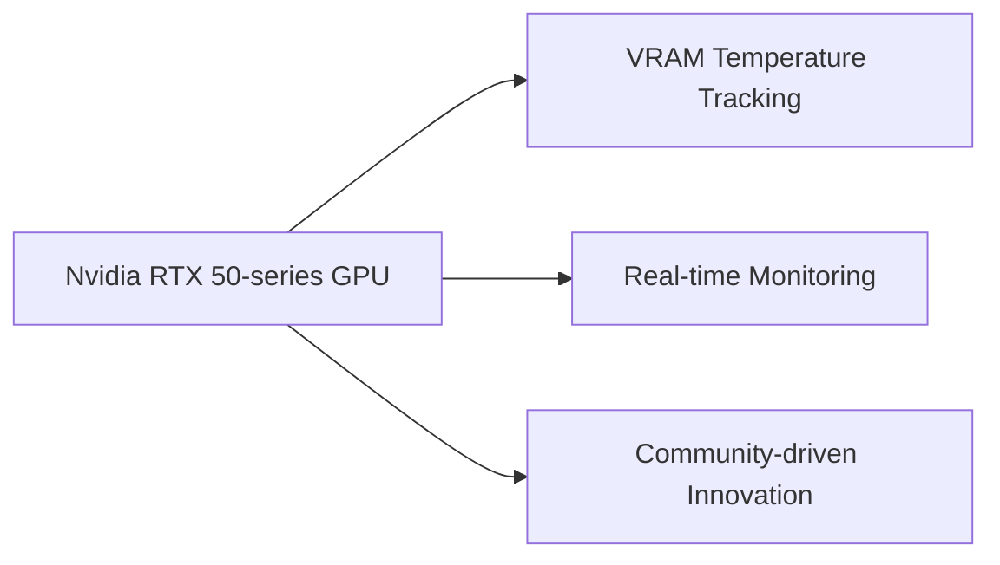

## The Soundtrack of Survival: Unpacking Leon's Musical Inspirations

In a recent interview, Nick Apostolides, the voice actor behind Leon Kennedy in the Resident Evil remake series, revealed the musical influences that helped shape his portrayal of the iconic character. Metallica and Nirvana are among the bands he drew inspiration from, which may seem surprising at first, but upon closer inspection, it makes sense. Both bands are known for their intense energy and emotional depth, qualities that are essential for a character like Leon, who has been through hell and back.

Apostolides' musical inspirations are a testament to the power of music in shaping our perceptions and emotions. Just as a well-crafted soundtrack can transport us to a different world, a well-acted performance can bring a character to life in a way that feels authentic and relatable. In the case of Leon Kennedy, his musical inspirations have helped to create a complex and nuanced character that has captivated audiences for decades.

## Unleashing the Power of Nvidia's RTX 50-series GPUs: A New Plugin for Granular VRAM Temperature Tracking

Meanwhile, in the world of gaming hardware, Nvidia has released a new plugin that unlocks granular VRAM temperature tracking on its RTX 50-series GPUs. This plugin, which was cracked open by the community, allows users to monitor their VRAM temperatures in real-time, providing valuable insights into the performance of their GPUs.

The importance of VRAM temperature tracking cannot be overstated. High VRAM temperatures can lead to reduced performance, increased power consumption, and even system crashes. By monitoring VRAM temperatures, gamers can identify potential issues before they become major problems, ensuring that their systems run smoothly and efficiently.

The new plugin is a testament to the power of community-driven innovation and the importance of transparency in the tech industry. By providing users with access to granular VRAM temperature tracking, Nvidia is demonstrating its commitment to delivering high-quality products and services that meet the needs of its customers.

## The Intersection of Gaming and Technology: A Look at the Future of GPU Performance

As we look to the future of gaming and technology, it's clear that the intersection of these two fields will continue to shape the industry in exciting and innovative ways. The new plugin for Nvidia's RTX 50-series GPUs is just one example of how technology is being used to improve gaming performance and user experience.

But what does the future hold? Will we see even more advanced plugins and tools that unlock the full potential of our GPUs? Only time will tell, but one thing is certain: the intersection of gaming and technology will continue to drive innovation and progress in the years to come.

## Conclusion

In conclusion, the world of gaming and technology is a complex and ever-evolving landscape, shaped by the intersection of art, music, and technology. From the musical inspirations of Nick Apostolides to the granular VRAM temperature tracking of Nvidia's RTX 50-series GPUs, there's no shortage of exciting developments in the world of gaming and tech. As we look to the future, one thing is certain: the possibilities are endless, and the intersection of gaming and technology will continue to shape the industry in exciting and innovative ways.

### Table: Key Features of the New Plugin

| Feature | Description |
| --- | --- |
| Granular VRAM Temperature Tracking | Allows users to monitor VRAM temperatures in real-time |
| Real-time Monitoring | Provides valuable insights into VRAM performance and power consumption |
| Community-driven Innovation | Demonstrates the power of community-driven innovation and transparency in the tech industry |

### Mermaid Diagram: Nvidia's RTX 50-series GPU Architecture

Note: The Mermaid diagram above is a simplified representation of Nvidia's RTX 50-series GPU architecture and is not intended to be a comprehensive or accurate representation of the actual hardware.
