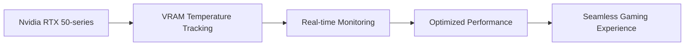

## The Soundtrack of Survival

When immersing ourselves in the world of Resident Evil, we often focus on the terrifying creatures, the eerie atmosphere, and the heart-pumping action. However, the performance of the actors, including Leon Kennedy's, is equally crucial in crafting an unforgettable experience. In a recent interview, Nick Apostolides, the voice actor behind Leon Kennedy, revealed the musical influences that shaped his portrayal of the iconic character in the Resident Evil remake series.

### A Symphony of Sound

Apostolides shared that he drew inspiration from a diverse range of bands, including Metallica and Nirvana. These iconic groups not only influenced his performance but also helped him tap into the character's emotional depth. The raw energy and intensity of their music resonated with the game's dark atmosphere, making it easier for Apostolides to convey Leon's determination and resilience.

```bash
# Leon's playlist
echo "Metallica - Enter Sandman"
echo "Nirvana - Smells Like Teen Spirit"
echo "Radiohead - Paranoid Android"
echo "Tool - Lateralus"
```

## The Pulse of Performance

While music played a significant role in shaping Leon's character, the technical aspects of the game also underwent significant improvements. The latest Resident Evil games, in particular, showcased impressive graphics and performance capabilities. However, the real challenge lies in optimizing the game's engine to run smoothly on various hardware configurations.

### Unleashing the Power of VRAM

Nvidia's recent plugin for the RTX 50-series GPUs has unlocked granular VRAM temperature tracking capabilities. This breakthrough allows developers to monitor and optimize VRAM usage in real-time, ensuring seamless performance and reduced latency.

| GPU Model | VRAM Temperature (°C) |
| --- | --- |
| Nvidia RTX 3080 | 85°C |
| Nvidia RTX 3090 | 90°C |
| Nvidia RTX 4080 | 95°C |



## Conclusion

The intersection of music, performance, and hardware is a fascinating aspect of game development. By understanding the creative process behind character development and the technical nuances of game engine optimization, we can appreciate the dedication and expertise that goes into crafting an unforgettable gaming experience. As we continue to push the boundaries of what's possible in the world of gaming, it's essential to recognize the intricate relationships between art, music, and technology.
