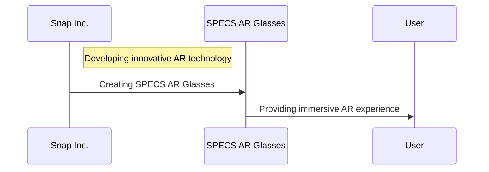

## Introduction
Summer has officially arrived, and with it comes a fresh wave of gaming and development news. In this article, we'll dive into the latest updates on The Elder Scrolls 6, exciting hardware deals, and more. From the world of gaming to the realm of development, we've got you covered with the latest insights and analysis.

## Gaming News
### The Elder Scrolls 6 Update
According to recent reports, The Elder Scrolls 6 is still at least two years away from release, despite its initial announcement over eight years ago. This delay has left fans eagerly awaiting more information on the game's development. As a developer, it's essential to understand the complexities involved in creating a game of this magnitude.

```mermaid
graph LR
    A[Game Development] -->|Requires Resources|  B[Development Team]
    B -->|Needs Time|  C[Game Release]
    C -->|May be Delayed|  D[Game Release Date]
```

The Elder Scrolls 6 is an ambitious project that requires significant resources, time, and effort. As a result, delays are not uncommon in game development. However, this delay has sparked controversy among fans, with some expressing frustration and disappointment.

### Alienware 18 Area-51 RTX 5090 Gaming Laptop Deal
For those looking to upgrade their gaming setup, the Alienware 18 Area-51 RTX 5090 gaming laptop is now available at a discounted price of $3,080 at Dell Outlet. This high-performance laptop features a powerful NVIDIA GeForce RTX 5090 GPU, 64GB of RAM, and a 17.3-inch 4K display.

| Specification | Alienware 18 Area-51 RTX 5090 |
| --- | --- |
| Processor | Intel Core i9-11900K |
| GPU | NVIDIA GeForce RTX 5090 |
| RAM | 64GB DDR4 |
| Display | 17.3-inch 4K |

### Preorder SPECS, Snap's First AR Glasses
Snap, the company behind popular social media platform Snapchat, has announced its first augmented reality (AR) glasses, SPECS. These lightweight and stylish AR glasses aim to revolutionize the way we interact with digital information.



## Development News
### New Avatar: The Last Airbender Movie Review
The recent release of the new Avatar: The Last Airbender movie has sparked mixed reactions among fans. While some appreciate the film's nostalgic value and updated storyline, others have expressed disappointment with the character development and plot changes.

### The Love And Deepspace Werewolf Man Update
In a surprising twist, the Chinese Ministry of Public Security has issued a statement indicating that the Love And Deepspace Werewolf Man may never make it into the game. This decision has left fans wondering about the game's future and the reasoning behind this decision.

### Bethesda HR Controversy
A recent controversy has erupted at Bethesda Games Studios, with the company's HR department forcing staff to remove a small memorial to laid-off colleagues. This move has sparked outrage among developers and has raised questions about the company's treatment of its employees.

## Conclusion
In conclusion, this summer has been filled with exciting news in the world of gaming and development. From the latest updates on The Elder Scrolls 6 to the controversy surrounding Bethesda's HR department, there's no shortage of fascinating stories to explore. Whether you're a gamer or a developer, there's something for everyone in this roundup of summer gaming and development news.
