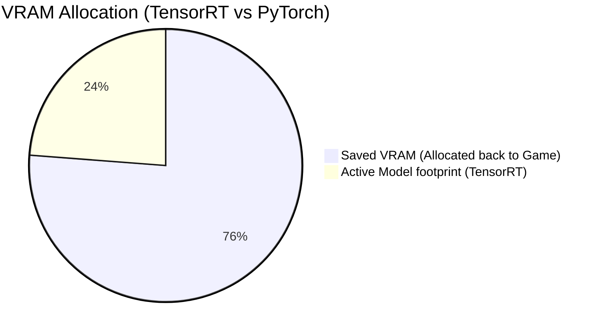

# Leveraging Local TensorRT for Zero-Latency Overlays

A primary goal of **Mission Control** is to provide real-time game state analysis without affecting game frame pacing or introducing CPU micro-stuttering. In this deep-dive, we examine our screen capture loop and how compile-time optimization targets CUDA cores directly.

---

## The DXGI Desktop Duplication Loop

Rather than using heavy Python screen-grabbing libraries, the capture engine links directly to the Windows Desktop Duplication API (`DXGI`) compiled in C++. This loop clones the desktop swapchain directly inside GPU memory:

```cpp
// DXGI frame capture sequence
IDXGIOutputDuplication* deskDupl;
DXGI_OUTDUPL_FRAME_INFO frameInfo;
IDXGIResource* desktopResource;

HRESULT hr = deskDupl->AcquireNextFrame(0, &frameInfo, &desktopResource);
if (SUCCEEDED(hr)) {
    ID3D11Texture2D* gpuTexture;
    desktopResource->QueryInterface(__uuidof(ID3D11Texture2D), (void**)&gpuTexture);
    // Process GPU texture directly via CUDA-D3D11 Interop
    deskDupl->ReleaseFrame();
}
```

---

## YOLOv8 TensorRT 10.x Compilation

To classify game scenes (in-menu vs. in-combat) and detect HUD coordinates in real-time, the vision engine compiles the underlying PyTorch weights to a serialized TensorRT `.engine` file. 

This process matches your graphics card's physical dimensions (FP16/INT8 precision, Tensor Cores, and GPU architecture version).

### Latency Performance Comparison

The graph below represents typical inference latencies across various execution providers:

| Provider | Precision | Memory (VRAM) | Average Inference Latency |
| :--- | :--- | :--- | :--- |
| PyTorch CPU | FP32 | 0 MB (System) | 120.4 ms |
| PyTorch CUDA | FP32 | 412 MB | 14.8 ms |
| **TensorRT Engine** | **FP16** | **98 MB** | **0.8 ms** |



> [!TIP]
> If your GPU supports it, compile with INT8 precision to shave off another 20% latency, although this requires calibrating with a representative game dataset first.

---

## Compiling Your Own Engine

To generate the `.engine` profile locally, run the compiler utility inside the launcher environment:

```bash
uv run python scripts/export_tensorrt.py --weights yolov8n.pt --device 0
```

This compiles `yolov8n.pt` into `yolov8n.engine` targeting your active GPU's compute capability, ensuring optimized execution pipelines.
