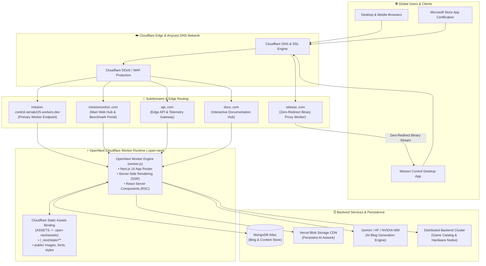

# ☁️ Cloudflare Workers Deployment & Subdomain Architecture Guide

This guide documents the production deployment architecture of the **Mission Control Web Platform (`Gaming/website`)** onto **Cloudflare Workers** using **OpenNext (`@opennextjs/cloudflare`)** and **Wrangler**.

---

## 1. Architectural Overview



---

## 2. Live Endpoints & Subdomain Mapping

The Mission Control platform is engineered to support both the default Cloudflare Workers subdomain and customized multi-subdomain configurations:

| Domain / Subdomain Pattern | Cloudflare Routing Mechanism | Target Component / Functionality |
| :--- | :--- | :--- |
| `https://mission-control.rarnab225.workers.dev` | **Workers Default Subdomain** | Primary live worker deployment endpoint hosting all routes, SSR, and API endpoints. |
| `missioncontrol.<domain>.com` | **Cloudflare Custom Domain** | Canonical production web address; serves the main landing page, hardware benchmarks, and download router. |
| `api.<domain>.com` | **Custom Domain / Route** | Dedicated API entry point routing to `/api/blogs`, `/api/download`, `/api/support/chat`, and bug report ingestors. |
| `docs.<domain>.com` | **Custom Domain / Route** | Specialized documentation entry point serving `/docs` architecture and setup manuals. |
| `release.<domain>.com` | **Cloudflare Release Proxy Worker** | Standalone edge worker (`scripts/cf-worker-release-proxy.js`) that proxies GitHub Release downloads with zero 302 redirects for Microsoft Store compliance. |

---

## 3. Subdomain Setup & Configuration in Cloudflare

Cloudflare Workers provides two primary methods for binding custom domains and subdomains:

### Method A: Cloudflare Dashboard (Recommended)

1. Log in to the [Cloudflare Dashboard](https://dash.cloudflare.com/).
2. Navigate to **Workers & Pages** ➔ Select the **`mission-control`** worker.
3. Click the **Settings** tab ➔ **Domains & Routes**.
4. Under **Custom Domains**, click **Add Custom Domain**:
   - Enter your primary domain (e.g., `missioncontrol.example.com`).
   - Click **Add Custom Domain**. Cloudflare handles DNS CNAME creation and edge SSL certificate provisioning automatically.
5. To attach additional subdomains (e.g., `api.example.com` or `docs.example.com`):
   - Repeat the **Add Custom Domain** flow for each subdomain pointing to `mission-control`.
   - The worker dynamically inspects the `Host` header and URL path to serve the appropriate App Router segment.

### Method B: Wrangler Configuration (`wrangler.jsonc`)

You can declare custom domain bindings directly in `Gaming/website/wrangler.jsonc`:

```jsonc
{
  "$schema": "node_modules/wrangler/config-schema.json",
  "name": "mission-control",
  "main": ".open-next/worker.js",
  "compatibility_date": "2024-09-23",
  "compatibility_flags": ["nodejs_compat"],
  "assets": {
    "directory": ".open-next/assets",
    "binding": "ASSETS"
  },
  "observability": {
    "enabled": true
  },
  "routes": [
    { "pattern": "missioncontrol.example.com/*", "custom_domain": true },
    { "pattern": "api.example.com/*", "custom_domain": true },
    { "pattern": "docs.example.com/*", "custom_domain": true }
  ]
}
```

---

## 4. Build & Deploy Commands

The repository includes pre-configured npm scripts utilizing `@opennextjs/cloudflare`:

```bash
# Navigate to website workspace
cd Gaming/website

# 1. Build Next.js 16 and package OpenNext assets into .open-next/
npm run build:cf
# (Runs: opennextjs-cloudflare build)

# 2. Deploy the built worker and assets to Cloudflare Edge
npm run deploy:cf
# Or directly via the Wrangler CLI:
npx wrangler deploy

# 3. Preview locally inside the Cloudflare workerd runtime
npm run preview:cf
# (Runs: opennextjs-cloudflare preview)
```

### Cloudflare Pages / Workers CI Settings

When configuring automated builds in Cloudflare Dashboard:

| Setting | Value |
| :--- | :--- |
| **Framework preset** | `None` / `Custom` |
| **Root directory** | `Gaming/website` |
| **Build command** | `npm run build:cf` |
| **Deploy command** | `npx wrangler deploy` |
| **Output directory** | `.open-next/assets` |
| **Compatibility flag** | `nodejs_compat` |
| **Compatibility date** | `2024-09-23` or newer |

---

## 5. Environment Variables & Secrets Management

Cloudflare Workers distinguishes between non-sensitive environment variables and secure secrets.

### Setting Secrets via Wrangler CLI

Run the following commands in `Gaming/website` to securely encrypt and store credentials in Cloudflare's edge key-value store:

```bash
# MongoDB Atlas connection string
npx wrangler secret put MONGODB_URI

# AI generation tokens
npx wrangler secret put GEMINI_API_KEY
npx wrangler secret put HF_TOKEN
npx wrangler secret put NVIDIA_API_KEY

# Cron authorization token
npx wrangler secret put CRON_SECRET

# Vercel Blob token for image asset persistence
npx wrangler secret put BLOB_READ_WRITE_TOKEN
```

### Setting Variables via Dashboard

1. Navigate to **Workers & Pages** ➔ **`mission-control`** ➔ **Settings** ➔ **Variables and Secrets**.
2. Add public variables such as `NEXT_PUBLIC_SITE_URL` (set to `https://mission-control.rarnab225.workers.dev` or your custom domain).

---

## 6. Microsoft Store Edge Release Proxy Worker

Microsoft Store Partner Center certification requires direct, non-redirecting (zero HTTP 302) streams for application binaries.

The worker script located at [`Gaming/scripts/cf-worker-release-proxy.js`](../scripts/cf-worker-release-proxy.js) runs alongside Mission Control on Cloudflare Workers:
- Intercepts requests for release installers.
- Resolves GitHub Releases redirect location on the edge without returning 302 redirects to Microsoft Store ingestion bots.
- Pipes binary chunks directly to the caller with appropriate `Content-Disposition`, `Content-Length`, and `Content-Type: application/octet-stream` headers.

---

## 7. Troubleshooting & Edge Gotchas

### Issue 1: "Minified React Error #412" (RSC Payload Client-Side Navigation)
- **Symptom**: Console logs `Failed to fetch RSC payload for ... Falling back to browser navigation. Error: Minified React error #412`.
- **Cause**: React Server Components (RSC) hydration mismatch between streaming edge response headers and client cache during client-side Next.js route transitions (`<Link>` prefetching).
- **Behavior**: Non-fatal. Next.js automatically detects the RSC payload mismatch and falls back gracefully to standard full browser navigation without breaking the user experience.

### Issue 2: "Failed to copy ... (unified, remark, mdx)" Build Warnings
- **Symptom**: Warning lines during `opennextjs-cloudflare build` stating `ERROR Failed to copy ... node_modules/unified`.
- **Explanation**: ESM-only packages (like `remark-gfm`, `unified`, `micromark`) are bundled directly into `.open-next/worker.js` by esbuild rather than copied into external Node module directories. The worker functions properly in production.

### Issue 3: Stale "Hello World" or Blank Responses
- **Cause**: If the Cloudflare deploy command is set to `exit 0`, the build completes but the worker bundle is not pushed.
- **Fix**: Ensure the deploy command is set to `npx wrangler deploy` or run `npm run deploy:cf`.
