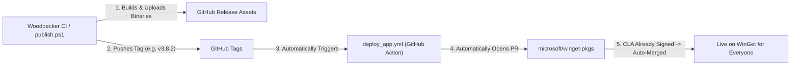

# Mission Control — Windows Package Manager (Winget) Setup

This directory contains the official **Winget** package manifests and automation tooling for installing and distributing **Mission Control** via the Windows Package Manager.

Package Identifier: `arnab825.MissionControl`  
Moniker: `mission-control`  
Architecture: `x64`  
Installer Type: `nullsoft` (NSIS)

---

## 🚀 Quick Install via Winget

### 1. From Official Repository (Once Published)
```powershell
winget install arnab825.MissionControl
```

Or by moniker:
```powershell
winget install --moniker mission-control
```

### 2. Local Direct Installation (From This Repository)
You can install Mission Control immediately without waiting for Microsoft review by pointing winget to the local manifest:

```powershell
# Using the helper script:
.\Gaming\winget\install.ps1 -Action Install

# Or using Winget directly with the manifest path:
winget install --manifest .\Gaming\winget\arnab825.MissionControl.singleton.yaml --accept-package-agreements --accept-source-agreements --force
```

---

## 🛠️ Management & Automation Script (`install.ps1`)

The included [`install.ps1`](./install.ps1) script provides complete automation:

| Command | Description |
| :--- | :--- |
| `.\install.ps1 -Action Validate` | Runs `winget validate --manifest` on both multi-manifest and singleton manifests against Microsoft's official schema. |
| `.\install.ps1 -Action Install` | Installs Mission Control locally on your Windows machine using the verified manifest. |
| `.\install.ps1 -Action UpdateHash` | Automatically computes the SHA256 of `Gaming/frontend/out/dist/MissionControl-Setup.exe` and updates both manifests. |
| `.\install.ps1 -Action Help` | Displays submission instructions and CLI usage. |

---

## 📂 Manifest Structure

- **Multi-Manifest Directory** (Compliant with [microsoft/winget-pkgs](https://github.com/microsoft/winget-pkgs) layout):
  ```
  manifests/
  └── a/
      └── arnab825/
          └── MissionControl/
              └── 3.7.7/
                  ├── arnab825.MissionControl.yaml (Version manifest)
                  ├── arnab825.MissionControl.installer.yaml (Installer manifest)
                  └── arnab825.MissionControl.locale.en-US.yaml (Default locale metadata)
  ```

- **Standalone Singleton Manifest**:
  - [`arnab825.MissionControl.singleton.yaml`](./arnab825.MissionControl.singleton.yaml) (All-in-one manifest for fast offline testing or local distribution)

---

## 🌐 Publishing to `microsoft/winget-pkgs`

### Automated Release Pipeline (Recommended)

Every new release tag (`v*`) triggers an automated GitHub Actions workflow to publish directly to Microsoft's official community repository:



### Manual CLI Submission (Fallback)

To manually submit or update without CI/CD:

1. **Install WingetCreate**:
   ```powershell
   winget install Microsoft.WingetCreate
   ```

2. **Submit Pre-Validated Manifests**:
   ```powershell
   wingetcreate submit .\Gaming\winget\manifests\a\arnab825\MissionControl\<version>
   ```

3. **Or Update from Release URL**:
   ```powershell
   wingetcreate update arnab825.MissionControl --version <version> --urls https://github.com/arnab825/Mission-Control/releases/download/v<version>/MissionControl-Setup.exe
   ```
   *(Requires a GitHub Personal Access Token with `public_repo` scope stored as `WINGET_GH_TOKEN`)*

