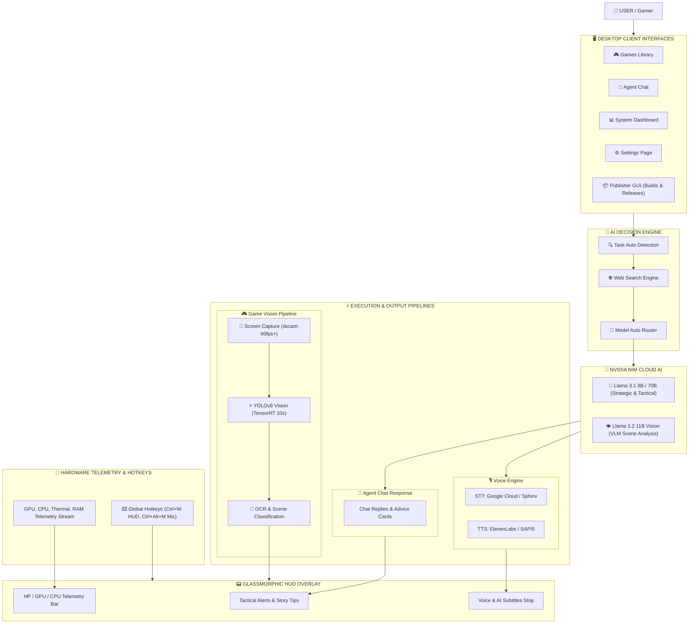

# 🧠 🎮 Mission Control — NVIDIA-Powered AI Gaming Platform

<p align="center">
  
</p>

<p align="center">
  <b>An advanced, real-time AI gaming assistant & intelligence ecosystem powering desktop performance, live tactical coaching, dynamic HUD overlays, hardware telemetry, and automated gaming news.</b>
</p>

<p align="center">
  <a href="#-repository-structure"></a>
  <a href="https://nextjs.org"></a>
  <a href="https://www.electronjs.org/"></a>
  <a href="https://fastapi.tiangolo.com/"></a>
  <a href="https://developer.nvidia.com/cuda-toolkit"></a>
  <a href="https://github.com/arnab825/Mission-Control/releases"></a>
</p>

---

## 📸 Interface & Capabilities Showcase

<table align="center">
  <tr>
    <td width="50%" align="center">
      <b>🖥️ Main Console & Dashboard</b><br/><br/>
      
    </td>
    <td width="50%" align="center">
      <b>🤖 Autonomous AI Co-Pilot & Tactical Agent</b><br/><br/>
      
    </td>
  </tr>
  <tr>
    <td width="50%" align="center">
      <b>📟 Glassmorphic HUD Overlay</b><br/><br/>
      
    </td>
    <td width="50%" align="center">
      <b>🎯 TensorRT AI Vision & YOLO Detection</b><br/><br/>
      
    </td>
  </tr>
  <tr>
    <td width="50%" align="center">
      <b>📊 Real-Time Hardware Telemetry</b><br/><br/>
      
    </td>
    <td width="50%" align="center">
      <b>🔬 Performance Tuning Lab & Power Controls</b><br/><br/>
      
    </td>
  </tr>
  <tr>
    <td width="50%" align="center">
      <b>🎮 Game Library & Auto-Sense Target Routing</b><br/><br/>
      
    </td>
    <td width="50%" align="center">
      <b>⚡ AI Hardware Readiness Matrix</b><br/><br/>
      
    </td>
  </tr>
</table>

---

## 📌 Monorepo Architecture Overview

**Mission Control** is an integrated platform split into three primary sub-projects designed to deliver ultra-low latency hardware monitoring, local AI vision, and high-performance gaming intelligence:

```
Mission-Control /
├── 🌐 Gaming/website/        # Next.js 15 (App Router) + Tailwind CSS + MongoDB
│                             # Web platform, documentation hub, and automated AI Gaming Intel blog pipeline.
│
├── 🖥️ Gaming/frontend/       # Electron + React + Vite + TypeScript
│                             # Desktop dashboard, glassmorphic HUD overlay, hotkeys engine, and telemetry UI.
│
├── 📦 Gaming/publisher-gui/  # Electron + Vite + Tailwind CSS
│                             # Build manager, installer generator, & release publishing client GUI.
│
├── 🐍 Gaming/backend/        # Python 3.12 + FastAPI + PyNVML + TensorRT + C++ DirectX DLL
│                             # Local AI brain, C++ FPS engine, TensorRT YOLO vision, hardware monitoring, & voice TTS/STT.
│
├── 📜 run_local.ps1          # Automated local build, package & release runner script.
└── ⚙️ .woodpecker/           # CI/CD pipelines for automated multi-platform desktop releases.
```

### 🧱 System Workflow Architecture

<table align="center" width="100%">
  <tr>
    <th colspan="3" style="text-align:center; background:#0f172a; color:#38bdf8; font-size:16px;">
      👤 USER / GAMER INTERACTION LAYER
    </th>
  </tr>
  <tr>
    <td width="33%" align="center"><b>🖥️ Electron Desktop Dashboard</b><br/>React + Vite HUD & Telemetry</td>
    <td width="33%" align="center"><b>📦 Publisher GUI Client</b><br/>Builds, Packaging & Releases</td>
    <td width="33%" align="center"><b>🎙️ Voice & Hotkey Controls</b><br/>Mic Toggle & Global Shortcuts</td>
  </tr>
  <tr>
    <th colspan="3" style="text-align:center; background:#111827; color:#a855f7; font-size:16px;">
      🧠 AI DECISION ENGINE & TASK AUTO-ROUTER
    </th>
  </tr>
  <tr>
    <td colspan="3" align="center">
      <b>Task Classifier ➔ Dynamic Web Search Engine</b> (Wikipedia | RAWG.io | SteamSpy | DuckDuckGo)<br/>
      <b>Model Router ➔ NVIDIA NIM Cloud AI</b> (Llama 3.1 8B/70B Strategic + Llama 3.2 11B Vision VLM)
    </td>
  </tr>
  <tr>
    <th colspan="3" style="text-align:center; background:#064e3b; color:#10b981; font-size:16px;">
      ⚡ REAL-TIME EXECUTION & TELEMETRY PIPELINES
    </th>
  </tr>
  <tr>
    <td width="33%" align="center"><b>🎮 Game Vision Pipeline</b><br/>dxcam 60fps ➔ TensorRT YOLOv8 ➔ OCR</td>
    <td width="33%" align="center"><b>🎙️ Voice Engine</b><br/>Google / Sphinx STT ➔ ElevenLabs / SAPI5 TTS</td>
    <td width="33%" align="center"><b>🔧 Hardware Telemetry</b><br/>C++ DirectX FPS DLL + PyNVML + WMI/PDH</td>
  </tr>
  <tr>
    <th colspan="3" style="text-align:center; background:#312e81; color:#818cf8; font-size:16px;">
      📟 GLASSMORPHIC HUD OVERLAY STREAM
    </th>
  </tr>
  <tr>
    <td colspan="3" align="center">
      <b>Tactical Alerts Cards • Real-time Min/Max FPS & Thermal Bar • Live Subtitles Strip</b>
    </td>
  </tr>
</table>



---

## 🚀 Sub-Project Quick Links

| Component | Stack | Description | Documentation |
|---|---|---|---|
| **Web Platform** | Next.js 15, TypeScript, Tailwind CSS, MongoDB | Live gaming intelligence web app, benchmark profiles, documentation, and RSS AI blog generator. | [Website README](Gaming/website/README.md) |
| **Desktop App** | Electron, React, Vite, Tailwind CSS | Real-time desktop application with glassmorphic HUD overlay, hardware telemetry, & keybindings. | [Frontend README](Gaming/frontend/README.md) |
| **Publisher GUI** | Electron, Vite, Tailwind CSS | Release packaging, installer generation, release manifest sync & asset publisher client. | [Publisher GUI README](Gaming/publisher-gui/README.md) |
| **Python Backend** | Python 3.12, FastAPI, C++, PyNVML, TensorRT | High-frequency telemetry service, native DirectX frame queue monitoring, and NVIDIA AI models. | [Backend README](Gaming/backend/README.md) |
| **Complete System** | Architecture & Versioning | Detailed technical patch notes, agentic logic, and system overview. | [System Manual](Gaming/readme.md) |

---

## 🎯 Key Features

- **⚡ Zero-Latency C++ DirectX FPS Tracking**: Native C++ DLL (`fps_counter.dll`) hooking into low-level presentation queues for 1% lows and instantaneous FPS telemetry without Python overhead.
- **🟢 NVIDIA TensorRT & NIM Acceleration**: Pure TensorRT inference for YOLOv8 vision detection with **0 MB PyTorch VRAM waste**, paired with NVIDIA NIM (Llama 3.1 & 3.2 Vision) cloud reasoning.
- **🖥️ Glassmorphic HUD Overlay**: Dynamic desktop overlay displaying real-time FPS, CPU/GPU temperatures, wattage, and active AI co-pilot tactical suggestions.
- **📰 Automated AI Gaming Intel Blog**: Vercel cron-scheduled RSS aggregator (IGN, Kotaku, Eurogamer, AnandTech, Tom's Hardware) running a 3-tier failover LLM pipeline to generate daily technical news saved directly to MongoDB Atlas.
- **🔒 Motherboard UUID Security & HW Telemetry**: Cryptographic Motherboard UUID locking, Win32 working set RAM flushing, and hardware telemetry via PyNVML, WMI, and PDH.

---

## 🛠️ Prerequisites & Requirements

- **Operating System**: Windows 10 / 11 (64-bit strictly required for native C++ DirectX hooks & NVML driver APIs).
- **GPU**: NVIDIA GeForce GTX / RTX series card (RTX 20, 30, 40, or 50 series recommended for TensorRT & DLSS telemetry).
- **Node.js**: v18.x or v20.x+
- **Python**: v3.12 (managed via [`uv`](https://github.com/astral-sh/uv))
- **Drivers**: NVIDIA Display Drivers R580+ & CUDA Toolkit 12.x+

---

## ⚡ Quick Start / Local Development

### 1. Repository Setup

```bash
# Clone the repository
git clone https://github.com/arnab825/Mission-Control.git
cd Mission-Control
```

### 2. Running the Next.js Web Platform

```bash
cd Gaming/website
npm install
npm run dev
# Web app runs at http://localhost:3000
```

### 3. Running the Electron Desktop App & Backend

```bash
# Terminal 1: Run Python Backend
cd Gaming/backend
uv sync
uv run main.py --dev

# Terminal 2: Run Electron Desktop App
cd Gaming/frontend
npm install
npm run dev
```

### 4. Running Automated Local Build Script

```powershell
# Run the local packaging & release pipeline
.\run_local.ps1
```

---

## 🌐 Live Web App & Deployments

- **Live Web Application**: [mission-control-roan-seven.vercel.app](https://mission-control-roan-seven.vercel.app)
- **Automated Blog Generation Endpoint**: Protected via `CRON_SECRET` at `/api/blogs/generate`
- **CI/CD Pipeline**: Woodpecker CI/CD configuration at `.woodpecker/release.yml`

---

## 📄 License

This repository is maintained under the project's custom license. See individual sub-directory licenses and documentation files for third-party component specifics.
