<div align="center">

# 🧠 🎮 Mission Control
### NVIDIA-Powered Autonomous AI Gaming Assistant & Telemetry Platform

<p align="center">
  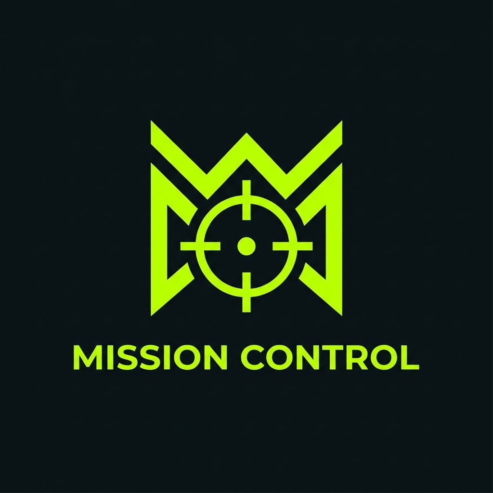
</p>

**Next-Generation In-Game Tactical AI Co-Pilot • Sub-15ms TensorRT Vision • Zero-VRAM HUD Telemetry**

<br/>

[](https://github.com/arnab825/Mission-Control/releases/latest)
[](https://github.com/arnab825/Mission-Control/stargazers)
[](https://github.com/arnab825/Mission-Control/milestones)
[](https://github.com/arnab825/Mission-Control/graphs/contributors)
[](https://developer.nvidia.com/tensorrt)
[](https://learn.microsoft.com/en-us/windows/package-manager/winget/)
[](CODE_OF_CONDUCT.md)
[](SECURITY.md)
[](CONTRIBUTING.md)
[](#-milestone-developer-benefits--contributor-rewards)

```bash
# ⚡ Install with 1 command via Windows Package Manager (Windows 10 / 11)
winget install arnab825.MissionControl
```

</div>

> 🎁 **Developer Milestone Rewards Program:** Merge 1 PR or conquer a milestone objective to unlock release notes recognition, Website Bot contributor showcase, and GitHub Collaborator status! Jump straight to [**Milestone Developer Benefits & Contributor Rewards**](#-milestone-developer-benefits--contributor-rewards).

> **The Future of PC Gaming Stations:** Move beyond archaic overlays like MSI Afterburner & RTSS. Mission Control combines **autonomous AI co-pilot reasoning (NVIDIA NIM)**, **sub-15ms TensorRT vision**, DXGI zero-copy game screen capture, and dynamic live patch search into an ultra-sleek cyberpunk HUD that operates with **zero PyTorch VRAM overhead**.

### 🥊 Feature Breakdown vs Traditional Setups

| Feature | 🦖 MSI Afterburner / RTSS | 👾 Discord / Game Launchers | 🚀 **Mission Control** |
| :--- | :---: | :---: | :---: |
| **Tactical AI Co-Pilot** | ❌ None | ❌ None | ✅ **Autonomous AI (NVIDIA NIM & Llama 3.1)** |
| **Real-Time Computer Vision** | ❌ None | ❌ None | ✅ **Pure TensorRT YOLOv8 (Sub-15ms)** |
| **VRAM & Memory Penalty** | Static / Clunky | 1,200 MB+ RAM | ✅ **0 MB PyTorch VRAM Penalty (TensorRT C++)** |
| **Live Patch & Game Intel** | ❌ None | ❌ None | ✅ **Automated Multi-Source Web RAG Search** |
| **Anti-Cheat Safety** | ⚠️ Invasive D3D Injections | Clunky Overlay | ✅ **Safe DirectX Desktop Duplication Hook** |
| **Design & Aesthetics** | 1998 Windows Form | Heavy Webview Wrapper | ✅ **Cyberpunk Glassmorphic HUD with Custom Font Scale** |

---

## 📸 Interface & Capabilities Showcase

<table align="center">
  <tr>
    <td width="50%" align="center">
      <b>🖥️ Main Console & Dashboard</b><br/><br/>
      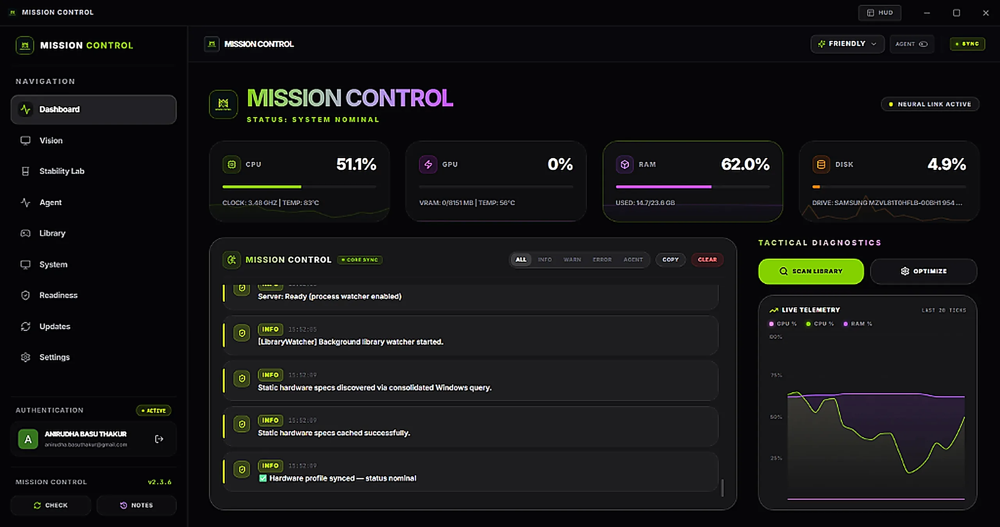
    </td>
    <td width="50%" align="center">
      <b>🤖 Autonomous AI Co-Pilot & Tactical Agent</b><br/><br/>
      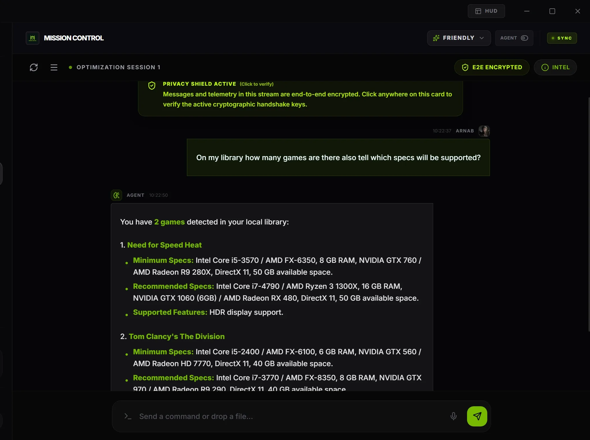
    </td>
  </tr>
  <tr>
    <td width="50%" align="center">
      <b>📟 Glassmorphic HUD Overlay</b><br/><br/>
      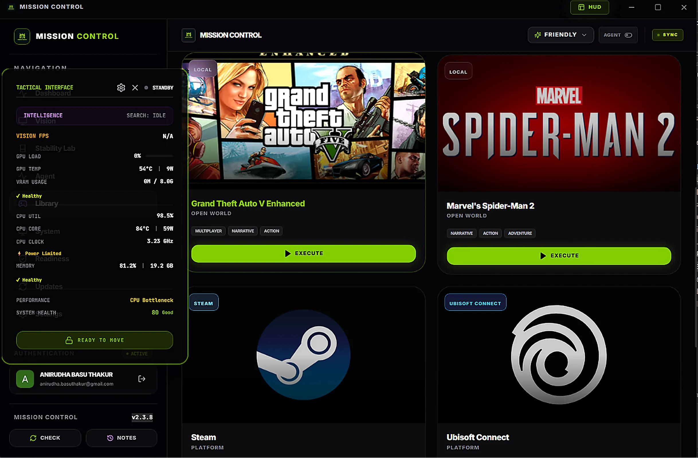
    </td>
    <td width="50%" align="center">
      <b>🎯 TensorRT AI Vision & YOLO Detection</b><br/><br/>
      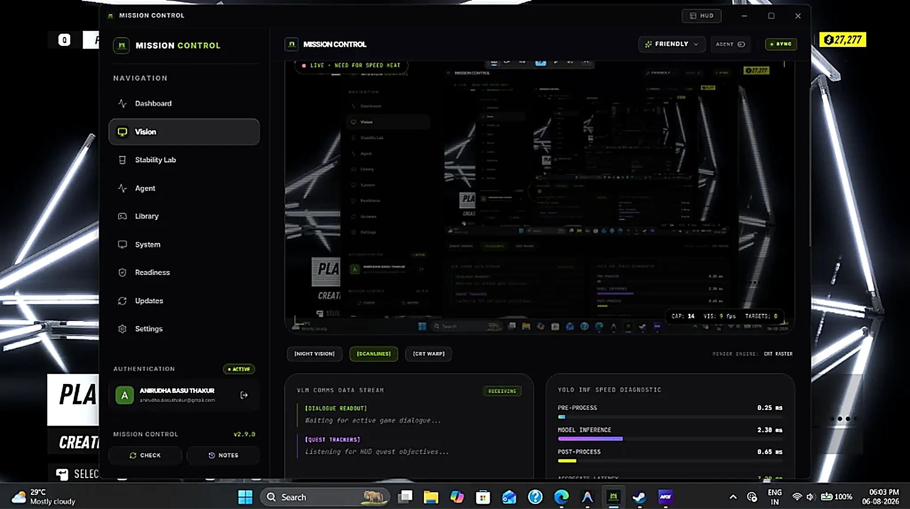
    </td>
  </tr>
  <tr>
    <td width="50%" align="center">
      <b>📊 Real-Time Hardware Telemetry</b><br/><br/>
      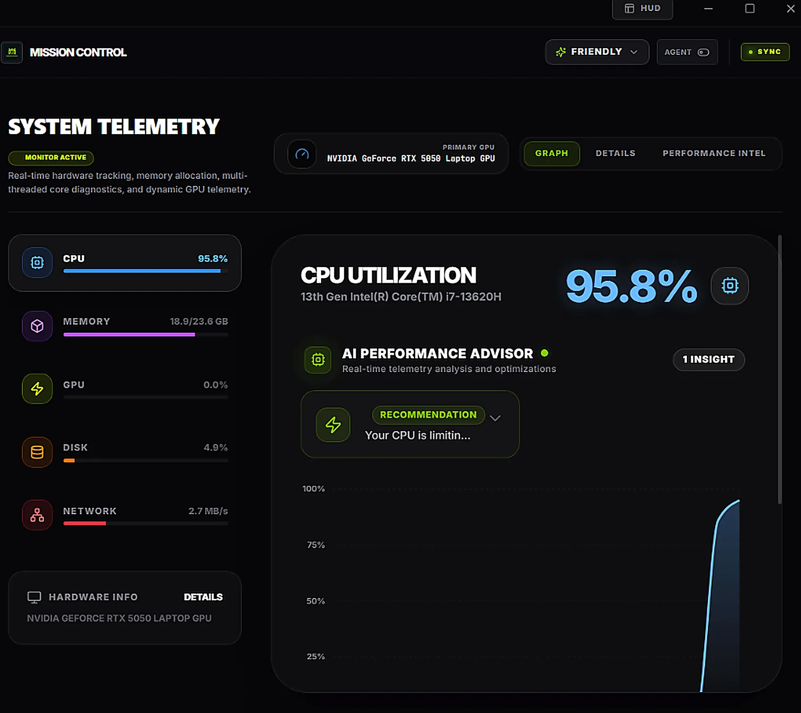
    </td>
    <td width="50%" align="center">
      <b>🔬 Performance Tuning Lab & Power Controls</b><br/><br/>
      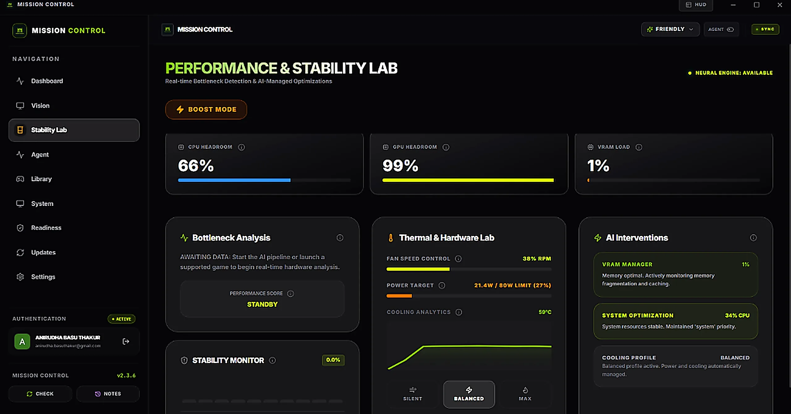
    </td>
  </tr>
  <tr>
    <td width="50%" align="center">
      <b>🎮 Game Library & Auto-Sense Target Routing</b><br/><br/>
      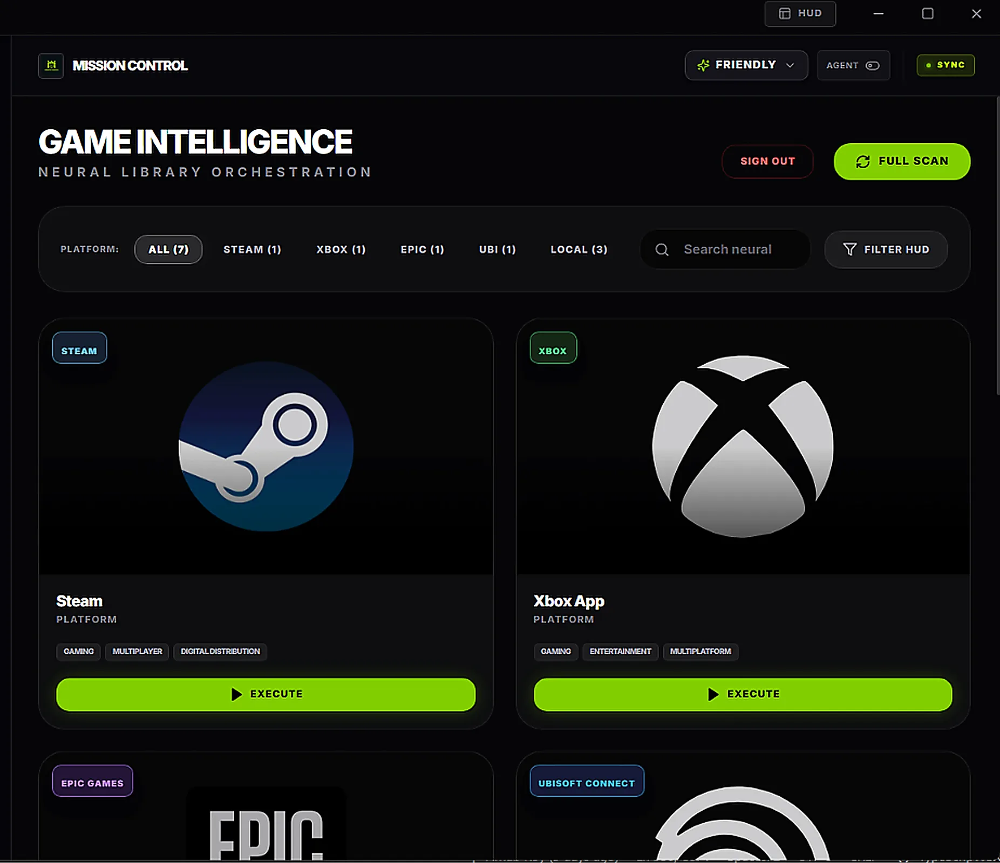
    </td>
    <td width="50%" align="center">
      <b>⚡ AI Hardware Readiness Matrix</b><br/><br/>
      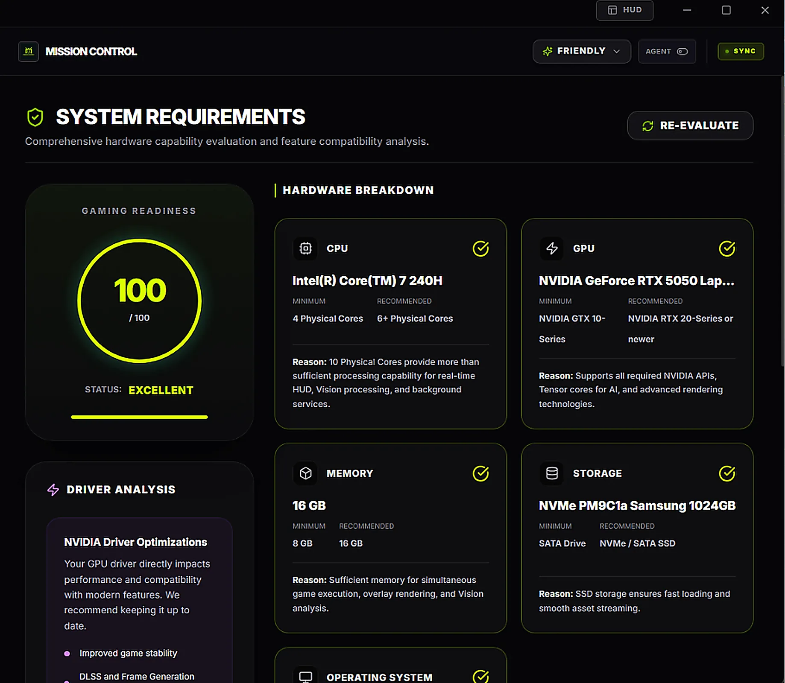
    </td>
  </tr>
  <tr>
    <td width="50%" align="center">
      <b>⚙️ System Settings & AI Neural Configuration</b><br/><br/>
      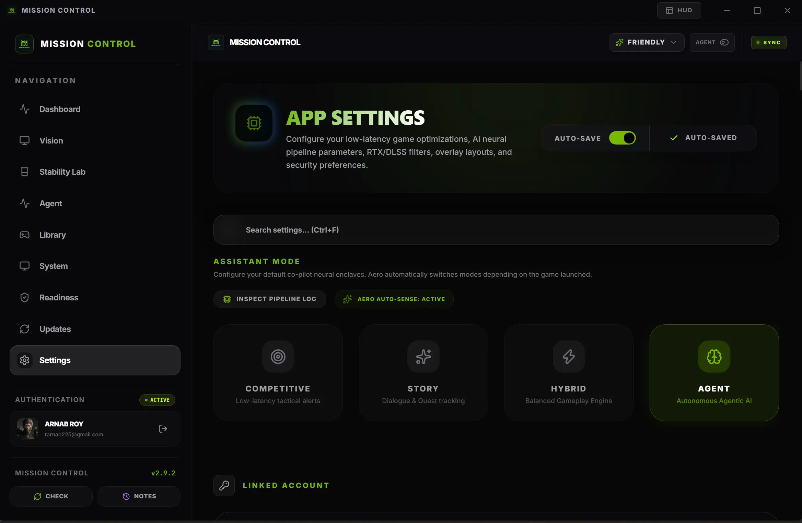
    </td>
    <td width="50%" align="center">
      <b>🔍 Deep Scanner & Library Auto-Discovery</b><br/><br/>
      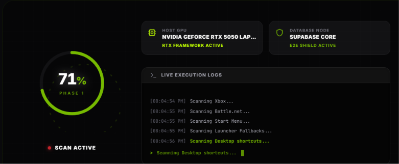
    </td>
  </tr>
</table>

---

## 📌 Monorepo Architecture Overview

**Mission Control** is an integrated platform split into three primary sub-projects designed to deliver ultra-low latency hardware monitoring, local AI vision, and high-performance gaming intelligence:

<div align="center">

| Module | Tech Stack | Role & Core Capabilities |
| :--- | :--- | :--- |
| **🌐 Web Platform**<br/>`Gaming/website/` |    | High-performance web portal, documentation station, and automated 4-tier AI Gaming Intel RSS blog pipeline. |
| **🖥️ Desktop Client**<br/>`Gaming/frontend/` |    | Real-time gaming dashboard, frameless glassmorphic HUD overlay, hotkey recorder, and hardware telemetry Bento UI. |
| **🐍 AI & Telemetry Engine**<br/>`Gaming/backend/` |    | Autonomous AI brain, zero-copy DXGI desktop frame capture at 120 FPS, YOLOv8 vision, C++ Present hook, and PyNVML. |
| **📦 Publisher Studio**<br/>`Gaming/publisher-gui/` |   | Internal packaging GUI, semver version bumper, installer compiler, and GitHub Releases distribution manager. |
| **⚙️ Pipeline & Distribution**<br/>`run_local.ps1` & `.woodpecker/` |   | Multi-platform packaging automation generating Windows (`.exe`, `.msi`, `.zip`) and Linux (`.deb`, `.AppImage`). |

</div>

### 🧱 System Workflow Architecture

<div align="center">

| Layer | Subsystem & Technologies | Responsibilities & Capabilities |
| :--- | :--- | :--- |
| **👤 Client UI** |    <br/>**Desktop Client & Glassmorphic HUD** | • Frameless titlebar IPC & `--is-auth-popup` lifecycle<br/>• Performance Lab, System Telemetry & Game Library<br/>• Adaptive `useBridge` hook with 100ms/150ms state batching |
| **🔒 Identity** |  <br/>**Tactical Authentication Gateway** | • Signature `#0b0d13` tactical canvas & `#76b900` neon green HUD theme<br/>• Watermarks, striped dev badges & footers suppressed<br/>• Seamless multi-account switching & secondary identity linking |
| **⚡ Protocol** |  <br/>**Aero Real-Time WebSocket Bridge** | • Origin validation (`localhost`, `127.0.0.1`, `file`, `vscode-webview`)<br/>• Clean RFC 6455 1000/1001 ("going away") graceful disconnects<br/>• Critical bypass filter for voice prompts, alerts & vision frames |
| **🔧 Telemetry** |  <br/>**Hardware Engine & Present Hook** | • C++ DirectX presentation hook for instant FPS & 1% low metrics<br/>• PyNVML monitor for GPU clocks, VRAM MB, thermals & power Watts<br/>• WMI / CIM / PDH CPU query chain & Win32 working set RAM compaction |
| **🎯 Vision AI** |   <br/>**On-Demand Vision Pipeline** | • `dxcam` zero-copy DirectX Desktop Duplication capture at 120 FPS<br/>• Pure TensorRT YOLOv8 inference saving ~1 GB PyTorch VRAM<br/>• RapidOCR / Tesseract dynamic dialogue and quest ROI extraction |
| **🧠 Agent Brain** |   <br/>**Autonomous Copilot & Web RAG** | • Multi-source RAG search across Wikipedia, SteamSpy, DuckDuckGo & RAWG<br/>• Strategic NIM reasoning (`Llama 3.1 8B/70B` + `Llama 3.2 11B Vision VLM`)<br/>• Dual voice engine with Google STT and ElevenLabs / SAPI5 TTS |
| **🌐 Node Cluster** |  <br/>**Distributed Library Network** | • Local `node_service.py` daemon with deterministic MAC-derived IDs<br/>• Multi-launcher game detection across Steam, Epic, GOG, Xbox & Riot<br/>• Byte-exact disk sizing and multi-tier cloud failover (30s/35s timeout) |
| **📦 Packaging** |  <br/>**Multi-Platform Release Pipeline** | • Single-command `publish.ps1` with semver bumping & `uv lock` alignment<br/>• Windows NSIS (`.exe`), MSI (`.msi`), ZIP (`.zip`) & Linux archives (`.tar.gz`)<br/>• Native Debian (`.deb`) and Universal Linux (`.AppImage`) packaging |

</div>

<br/>

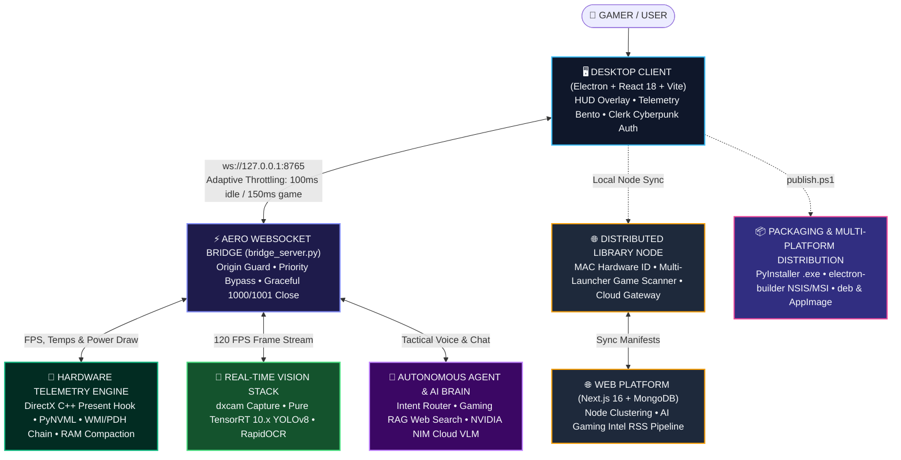
```mermaid
flowchart TD
    classDef client fill:#0f172a,stroke:#38bdf8,stroke-width:2px,color:#f8fafc;
    classDef bridge fill:#1e1b4b,stroke:#818cf8,stroke-width:2px,color:#f8fafc;
    classDef telemetry fill:#022c22,stroke:#10b981,stroke-width:2px,color:#f8fafc;
    classDef vision fill:#14532d,stroke:#4ade80,stroke-width:2px,color:#f8fafc;
    classDef ai fill:#3b0764,stroke:#c084fc,stroke-width:2px,color:#f8fafc;
    classDef cluster fill:#1e293b,stroke:#f59e0b,stroke-width:2px,color:#f8fafc;
    classDef release fill:#312e81,stroke:#ec4899,stroke-width:2px,color:#f8fafc;

    User(["👤 GAMER / USER"]) --> Desktop["🖥️ DESKTOP CLIENT (Electron + React 18 + Vite)<br/>HUD Overlay • Telemetry Bento • Clerk Cyberpunk Auth"]:::client
    
    Desktop <-->|"ws://127.0.0.1:8765<br/>Adaptive Throttling: 100ms idle / 150ms game"| Bridge["⚡ AERO WEBSOCKET BRIDGE (bridge_server.py)<br/>Origin Guard • Priority Bypass • Graceful 1000/1001 Close"]:::bridge

    Bridge <-->|"FPS, Temps & Power Draw"| Telemetry["🔧 HARDWARE TELEMETRY ENGINE<br/>DirectX C++ Present Hook • PyNVML • WMI/PDH Chain • RAM Compaction"]:::telemetry
    Bridge <-->|"120 FPS Frame Stream"| Vision["🎯 REAL-TIME VISION STACK<br/>dxcam Capture • Pure TensorRT 10.x YOLOv8 • RapidOCR"]:::vision
    Bridge <-->|"Tactical Voice & Chat"| Agent["🧠 AUTONOMOUS AGENT & AI BRAIN<br/>Intent Router • Gaming RAG Web Search • NVIDIA NIM Cloud VLM"]:::ai

    Desktop -.->|"Local Node Sync"| NodeDaemon["🌐 DISTRIBUTED LIBRARY NODE<br/>MAC Hardware ID • Multi-Launcher Game Scanner • Cloud Gateway"]:::cluster
    NodeDaemon <-->|"Sync Manifests"| WebPortal["🌐 WEB PLATFORM (Next.js 16 + MongoDB)<br/>Node Clustering • AI Gaming Intel RSS Pipeline"]:::cluster

    Desktop -.->|"publish.ps1"| Packaging["📦 PACKAGING & MULTI-PLATFORM DISTRIBUTION<br/>PyInstaller .exe • electron-builder NSIS/MSI • deb & AppImage"]:::release
```

---

## 🚀 Sub-Project Quick Links

| Component | Stack | Description | Documentation |
|---|---|---|---|
| **Web Platform** | Next.js 16, TypeScript, Tailwind CSS, MongoDB | Live gaming intelligence web app, benchmark profiles, documentation, and RSS AI blog generator. | [Website README](Gaming/website/README.md) |
| **Desktop App** | Electron, React, Vite, Tailwind CSS | Real-time desktop application with glassmorphic HUD overlay, hardware telemetry, & keybindings. | [Frontend README](Gaming/frontend/README.md) |
| **Publisher GUI** | Electron, Vite, Tailwind CSS | Release packaging, installer generation, release manifest sync & asset publisher client. | [Publisher GUI README](Gaming/publisher-gui/README.md) |
| **Python Backend** | Python 3.12, FastAPI, C++, PyNVML, TensorRT | High-frequency telemetry service, native DirectX frame queue monitoring, and NVIDIA AI models. | [Backend README](Gaming/backend/README.md) |
| **Complete System** | Architecture & Versioning | Detailed technical patch notes, agentic logic, and system overview. | [System Manual](Gaming/readme.md) |

---

## 🎯 Key Features

- **⚡ Zero-Latency C++ DirectX FPS Tracking**: Native C++ DLL (`fps_counter.dll`) hooking into low-level presentation queues for 1% lows and instantaneous FPS telemetry without Python overhead.
- **🟢 NVIDIA TensorRT & NIM Acceleration**: Pure TensorRT inference for YOLOv8 vision detection with **0 MB PyTorch VRAM waste**, paired with NVIDIA NIM (Llama 3.1 & 3.2 Vision) cloud reasoning.
- **🖥️ Glassmorphic HUD Overlay**: Dynamic desktop overlay displaying real-time FPS, CPU/GPU temperatures, wattage, and active AI co-pilot tactical suggestions.
- **📰 Automated AI Gaming Intel Blog**: Vercel cron-scheduled RSS aggregator (IGN, Kotaku, Eurogamer, AnandTech, Tom's Hardware) running a 3-tier failover LLM pipeline to generate daily technical news saved directly to MongoDB Atlas.
- **🔒 Motherboard UUID Security & HW Telemetry**: Cryptographic Motherboard UUID locking, Win32 working set RAM flushing, and hardware telemetry via PyNVML, WMI, and PDH.

---

## 🛠️ Prerequisites & Requirements

- **Operating System**: Windows 10 / 11 (64-bit) or Linux (Ubuntu 22.04+, Arch, Fedora x86_64).
- **GPU**: NVIDIA GeForce GTX / RTX series card (RTX 20, 30, 40, or 50 series recommended for TensorRT & DLSS telemetry).
- **Node.js**: v18.x or v20.x+
- **Python**: v3.12 (managed via [`uv`](https://github.com/astral-sh/uv))
- **Drivers**: NVIDIA Display Drivers R580+ & CUDA Toolkit 12.x+
- **Download Packages**: Windows (`.exe`, `.msi`, `.zip`) & Linux (`.AppImage`, `.deb`, `.rpm`, `.tar.gz`) available via GitHub Releases and the web platform.

---

## ⚡ Quick Start / Local Development

### 1. Repository Setup

```bash
# Clone the repository
git clone https://github.com/arnab825/Mission-Control.git
cd Mission-Control
```

### 2. Contributor Environment Setup (Zero-Secrets Policy)

To protect production infrastructure and let developers work without sharing credentials, Mission Control provides an automated setup command that initializes safe local environment templates:

```bash
# Initialize local development environment files (.env / .env.local)
cd Gaming/website
npm run setup
```

> **Security Note:** All created `.env` and `.env.local` files are strictly gitignored. Real production API keys remain securely configured in deployment platforms (Vercel, Render, Azure) and are never committed.

### 3. Running the Next.js Web Platform

```bash
cd Gaming/website
npm install
npm run dev
# Web app runs at http://localhost:3000
```

### 4. Running the Electron Desktop App & Backend

```bash
# Terminal 1: Run Python Backend
cd Gaming/backend
uv sync
uv run main.py --dev

# Terminal 2: Run Electron Desktop App
cd Gaming/frontend
npm install
npm run dev
```

### 4. Running Automated Packaging & Deployment Pipeline

```powershell
# Run the single-command multi-platform release script
.\Gaming\scripts\publish.ps1 -Type "patch" -Title "Release Title" -Changes "Feature description 1; Feature description 2"
```

---

## 📅 Roadmap Progress

- [x] Phase 1–10: Screen capture, YOLO vision, multi-threaded pipeline, story/quest support, memory, input devices, NVIDIA tech, TensorRT, Blackwell
- [x] Phase 11: System & Hardware Dashboard + Full Settings Page
- [x] Phase 12: In-App Auto-Update System
- [x] Phase 13: Agentic AI Assistant (G-Assist interface + Stability Lab)
- [x] Phase 14: NVIDIA NIM full reasoning integration
- [x] Phase 15: Agent mode with autonomous co-pilot
- [x] Phase 16: Multi-model pipeline optimization
- [x] Phase 17: Multi-modal vision (VLM + Deep Scene Analysis)
- [x] Phase 18: Adaptive Agent Personalities
- [x] Phase 19: High-Reliability Voice Engine (ElevenLabs + Google + SAPI5)
- [x] Phase 20: Autonomous Gameplay Validation + Safety Lab
- [x] Phase 21: **Gaming Web Search Intelligence (Wikipedia + RAWG + SteamSpy + DDG)**
- [x] Phase 22: **Hotkey Recorder UI + Auto Model Routing**
- [x] Phase 23: **UX Reusability & Logging Stability (React hooks, formatting, log fix)**
- [x] Phase 24: **Hardware Diagnostics & Testing Integration (Vitest, RTL, HW Telemetry Overhaul)**
- [x] Phase 25: **Electron autoUpdater & Squirrel Windows/Mac Installation Hooks**
- [x] Phase 26: **Electron Forge Multi-Platform Packing Configuration (Squirrel, DEB, RPM)**
- [x] Phase 27: **Dynamic Clerk SSO/OAuth Linked Accounts (Google, Discord, Microsoft)**
- [x] Phase 28: **Motherboard Hardware UUID & Dynamic Cryptographic E2EE Binds**
- [x] Phase 29: **Bytecode-Free Pycache-Bypass Guard & Zombie Process Fail-Fast**
- [x] Phase 30: **2-Column Glassmorphic Privacy & Neural Security Grid Upgrade**
- [x] Phase 31: **Active Backend Security Enforcer & Dynamic Motherboard UUID Lock**
- [x] Phase 32: **Sleek Telemetry UI, Dynamic Library Presets & Substring Genre Matching**
- [x] Phase 33: **DirectX C++ FPS Engine, Precision HUD Telemetry & Python 3.13 Warning Filters**
- [x] Phase 34: **TensorRT Integration & Aggressive Win32 Working Set RAM Flushing**
- [x] Phase 35: **Electron Build & Package Automation and Website Installer Direct Downloads**
- [x] Phase 36: **Distributed Autonomous Library Node Network (`distributed_node`)**
  - Autonomous `node_service.py` daemon with deterministic MAC-derived hardware IDs (`NODE-XXXXXX`).
  - Deep local drive multi-launcher scanning across Steam, Epic Games, GOG Galaxy, Xbox App, Battle.net, Riot Games, and Ubisoft Connect.
  - Byte-exact game storage calculation (`storage_calculator.py`) and periodic heartbeats with Azure/Render multi-tier cloud gateway failover.
- [x] Phase 37: **Automated AI Gaming Intel Pipeline & RSS Feed Ingestion**
  - Daily 5:30 AM IST automated cron pipeline on Next.js 16 App Router at `/api/blogs/generate`.
  - Ingestion across IGN, Kotaku, Eurogamer, Tom's Hardware, and AnandTech RSS feeds.
  - 3-tier LLM text generation failover (Google Gemini Flash → Hugging Face LLM → NVIDIA NIM).
  - 4-tier image generation pipeline (Gemini Imagen 3 → Hugging Face FLUX.1 → Pollinations AI → 3D artwork fallback) with persistent Vercel Blob CDN upload.
- [x] Phase 38: **Tactical Settings Command Deck & Inline Notification System**
  - Elimination of blocking native OS alerts, replacing them with inline glowing tactical HUD banners.
  - Unified 6-module settings navigation deck with category filters, search debouncing, and glowing icon badges.
  - Seamless one-click session reverification and secondary identity management.
- [x] Phase 39: **Custom Cyberpunk Clerk Theme Engine (`clerkTheme.ts`)**
  - Full Mission Control theme integration across Clerk's `<UserProfile />` modal, `<UserButton />`, and authentication gateways.
  - Signature `#0b0d13` tactical canvas, `#76b900` neon green active indicators, glassmorphic `backdrop-blur-md bg-black/85`, and rounded-3xl borders.
  - Total suppression of development-mode watermark badges, diagonal striped banners, and footers via `unsafe_disableDevelopmentModeWarnings: true` and CSS overrides.
- [x] Phase 40: **Aero Bridge WebSocket Resilience & Graceful Disconnects**
  - WebSocket engine updated to recognize RFC 6455 code `1001` (`CLOSE_GOING_AWAY`) and `ConnectionClosedOK` during Vite Hot Module Reloading and route navigation, eliminating false-positive warning alerts.
  - Outbound message queue buffering during reconnects and instant socket reconnection.
- [x] Phase 41: **Bulletproof CI/CD Release Pipeline & Automated `uv.lock` Sync (`publish.ps1`)**
  - Automated `uv lock` synchronization right after semver bump in `backend/pyproject.toml`.
  - Comprehensive staging of all manifests, lockfiles, and markdown documentation (`docs/`, `website/docs/`, `website/version.json`).
  - Automatic commit amending and Git release tag realignment (`vX.Y.Z`) ensuring 100% of artifacts and notes are published to GitHub Releases.


---

## 🤝 Community, Contributing & Developer Perks

We actively welcome contributions from developers, gamers, and open-source enthusiasts! Whether you are optimizing a Direct3D swapchain, adding AMD/Intel telemetry drivers, writing Python sensor daemons, or building Next.js web benchmarks, your work is recognized and rewarded.

### 🎁 Milestone Developer Benefits & Contributor Rewards

To recognize and engage external developers and community contributors who help achieve project milestones, Mission Control offers the following milestone benefits and official profile badges:

> 🎯 **Community-First Eligibility:** Milestone benefits and contributor rewards are designed exclusively to recognize and empower **new and community developers**. Founding maintainers (`@arnab825`, `@Ani0811`) and automated bots (`dependabot[bot]`) are excluded from claiming milestone reward tiers to ensure all perks, registry spots, and badges go directly to community contributors!

| Tier | Official Profile Badge | Requirement | Milestone Benefits & Perks |
| :--- | :---: | :--- | :--- |
| 🥉 **First-Time Contributor** | [](https://github.com/arnab825/Mission-Control) | 1 merged PR on any `good-first-issue` | • Listed in the official GitHub Release Notes.<br>• Featured in the [Website Support Bot](https://mission-control-taupe-mu.vercel.app) Contributor Registry.<br>• `@Contributor` role in community discussions. |
| 🥈 **Milestone Builder** | [](https://github.com/arnab825/Mission-Control) | 2+ merged PRs tied to an active **GitHub Milestone** | • Co-author credits (`Co-authored-by:`) on the major version tag.<br>• Permanent shoutout in [`docs/changes_summary.md`](docs/changes_summary.md).<br>• Fast-track review on future Pull Requests. |
| 🥇 **Core Subsystem Maintainer** | [](https://github.com/arnab825/Mission-Control) | Lead author on a core milestone objective (e.g. AMD ADLX telemetry, DirectStorage hook, or AI model integration) | • GitHub **Triage / Collaborator** invitation.<br>• Core Team badge on your GitHub profile.<br>• Direct influence on the upcoming [System Roadmap](ROADMAP.md).<br>• Professional technical recommendation on LinkedIn / GitHub. |

---

> ⚡ **100% Automated Recognition:** No manual claim required! Our [Contributor Milestone Workflow](.github/workflows/contributor_recognition.yml) automatically detects merged milestone PRs, resolves your **Full Name** and **GitHub @Username**, posts your custom badge on your PR, and registers you in [`CONTRIBUTORS.json`](CONTRIBUTORS.json) and the Website Support Bot registry.

#### 🛡️ Anti-Bypass & Verified Credential Issuance

> 🔒 **Tamper-Proof Contributor Badges:**
> To protect milestone integrity and prevent unauthorized badge claiming, **raw copy-paste badge markdown is strictly not provided in this public README**.
> 
> Official contributor badges and personalized markdown snippets are **generated and issued exclusively by GitHub Actions directly inside your merged Pull Request comment**. Each issued badge is cryptographically linked to your specific merged Pull Request (`#PR_NUMBER`) and indexed in the [Official Contributor Registry (`CONTRIBUTORS.json`)](CONTRIBUTORS.json). Badges displayed without a valid merged PR link or registry record are unverified.

---

### 👥 Contributor Hall of Fame

A heartfelt thank you to everyone pushing code, improving documentation, and reporting benchmarks for **Mission Control**:

<p align="center">
  <a href="https://github.com/arnab825/Mission-Control/graphs/contributors">
    
  </a>
</p>

---

### 🚀 Get Involved & Claim Your Perks

Ready to contribute and build your developer portfolio? Here is how to dive in right away:

* 🎯 **[Browse Active GitHub Milestones](https://github.com/arnab825/Mission-Control/milestones)** — Track upcoming sprint objectives and claim issues tagged to current targets.
* 🏷️ **[Good First Issues Guide](GOOD_FIRST_ISSUES.md)** — Curated bite-sized tasks across Web, Desktop, and Backend (also browse [Open Good-First-Issues on GitHub](https://github.com/arnab825/Mission-Control/issues?q=is%3Aissue+is%3Aopen+label%3A%22good+first+issue%22)).
* 🗺️ **[System Architecture Roadmap](ROADMAP.md)** — Explore strategic milestones including AMD RDNA telemetry, DirectStorage I/O hooks, and local AI vision co-pilot.
* 🛠️ **[Full Contributing Guide & Rewards Policy](CONTRIBUTING.md#milestone-developer-benefits--contributor-rewards)** — Complete step-by-step local environment setup (`npm run setup`), coding standards, and PR submission checklist.
* 💬 **[Community Discussions & Ideas](https://github.com/arnab825/Mission-Control/discussions)** — Connect with the team, pitch new game benchmark profiles, and propose architectural RFCs.

---

## 📄 License

This repository and open-source codebase are licensed under the **[Apache License 2.0](LICENSE)**. See the root [LICENSE](LICENSE) file and [Desktop App EULA](Gaming/frontend/electron/license.txt) for details.

