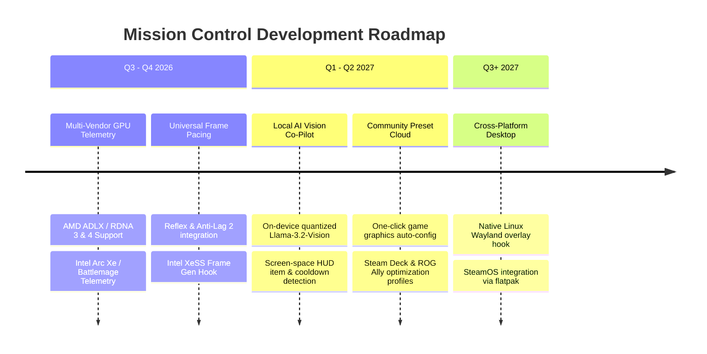

# 🗺️ Mission Control System Roadmap

Welcome to the **Mission Control Product & Architectural Roadmap**. This document outlines our strategic milestones, upcoming hardware capabilities, multi-vendor telemetry expansions, and AI gaming co-pilot features.

---

## 📍 Current Status: v3.7.9 (Production Stable)

- ✅ **NVIDIA TensorRT & CUDA Telemetry Engine**: Zero-overhead hardware polling via NVML/WMI with sub-15ms telemetry loops.
- ✅ **DirectX 12 HUD Overlay**: Seamless transparent in-game telemetry overlay with zero input lag.
- ✅ **Next.js 16 Production Web Platform**: Automated AI Gaming Intel blog engine, benchmark database, and Edge-cached APIs.
- ✅ **Unified Multi-Cloud Deployment**: Primary deployment on Vercel Edge Network paired with automatic standalone container failover on Azure Web Apps.
- ✅ **3-Tier AI Generation & Diagnostics Pipeline**: Gemini Flash ➔ Hugging Face Inference ➔ NVIDIA NIM failover architecture.

---

## 🚀 Strategic Roadmap & Upcoming Milestones

---

### Phase 1: Multi-Vendor GPU Expansion (AMD & Intel)
*   **AMD RDNA 3 & RDNA 4 Architecture Support**:
    *   Integrate AMD Display Library Extra (ADLX) C++ and Python bindings.
    *   Monitor AMD Radeon RX 7000/8000 junction temperatures, VRAM clock speeds, and Total Board Power (TBP).
    *   Add automated toggles for AMD Radeon Anti-Lag 2, Radeon Super Resolution (RSR), and HYPR-RX profiles.
*   **Intel Arc Xe / Battlemage Telemetry**:
    *   Direct hook into Intel Control Lib (Intel GPU telemetry SDK) for Arc A-Series and B-Series GPUs.
    *   Monitor Xe-core utilization, XMX engine activity, and XeSS scaling presets.

---

### Phase 2: Autonomous Agentic In-Game Co-Pilot
*   **Local Tensor-Accelerated Vision**:
    *   Execute quantized on-device vision models (e.g. lightweight Moondream / Llama-3.2-Vision) using TensorRT-LLM and ONNX Runtime DirectML.
    *   Real-time analysis of in-game minimap pings, kill feeds, and tactical cooldown timers without cloud round-trip latency.
*   **Dynamic Performance Alerting**:
    *   Heuristic thermal throttling detection alerting players when ambient GPU junction heat crosses 95°C.
    *   1% low FPS dip diagnosis (distinguishing between CPU thread bottlenecks and VRAM overflow).

---

### Phase 3: Universal Graphics & Preset Sync
*   **Community Game Configuration Hub**:
    *   Download crowd-verified graphic settings optimized for specific CPU/GPU pairings (e.g. RTX 4060 + Ryzen 5 7600X).
    *   One-click direct write to game configuration files (`.ini`, `.cfg`, `.json`) with automatic backup safeguards.
*   **Handheld PC Optimization Profiles**:
    *   Custom low-power TDP profiles (15W - 30W) calibrated for ROG Ally (Z1 Extreme), Lenovo Legion Go, and MSI Claw.

---

### Phase 4: Linux & Handheld Ecosystem
*   **Vulkan & Wayland Native Overlay**:
    *   Implement Gamescope-compatible overlay layers for Linux gamers.
    *   Package Mission Control as a native Flatpak on SteamOS / Arch Linux.

---

## 📚 Related Documentation

- 📖 [Detailed NVIDIA Hardware Strategy](Gaming/docs/ProductRoadmap.md)
- 🖥️ [Desktop Electron Architecture & Window Lifecycle](Gaming/docs/ElectronRoadmap.md)
- 🤝 [Contributing Guidelines](CONTRIBUTING.md)
- 🏷️ [Good First Issues for New Contributors](GOOD_FIRST_ISSUES.md)
